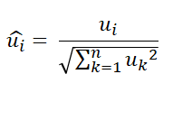
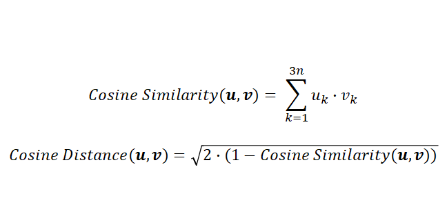
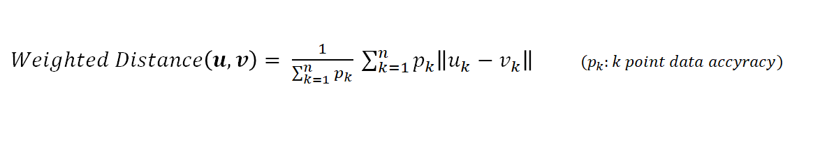

# pose-similarity-yeorae

### 1. Determination of similarity

​	Through the Pose Detection Node, the three-dimensional coordinates (x, y, z) of the body part and the accuracy (visibility) of the coordinates are derived. First, array having  elements that is composed by body position coordinates is defined as a feature vector. Assuming that n body position data are used, the vector is as follows.


​	This is used to check the similarity of pose. Data is preprocessed through vector normalization to determine the similarity of pose. And use Cosine Distance and Weighted Distance as Hybrid.


##### 1) Vector Normalization

​	Vector normalization is the operation of matching the scaling of vectors having different sizes. This process prevents data distortion and makes Cosine distance calculation simple. Vector Normalization was normalized based on the L2 Norm of the Euclidean space. The expression is:

 



##### 2) Cosine Distance

​	Cosine Distance is a very good way to check the similarity of two vectors. Even if the scale difference between the two vectors is large, if the directions are the same, it determine that they are similar. The cosine distance can be easily obtained through the pre-normalized Cosine similarity of two vectors u and v.



##### 3) Weighted Distance

​	Cosine Distance is a good criterion for judging the similarity of two vectors, but an inaccurate vector element is also a criterion for judging the same. To solve this problem, Distance weighted on data accuracy can be used as a criterion for determining similarity.




### 2. Input and Output

##### 1) Key Point Definition 

- The key point expresses the positional coordinates and accuracy of the body pose calculated by Pose Detection. Objects representing position and accuracy are stored in the form of an array.

```
Key point : [ ... ,{"x": float, "y":float, "z":float, "visibility": float}, ...]
```


##### 2) pose-similarity-find Node

- This node receives a number of input key points (ex: sequence of continuous time) and determines the similarity to the saved pose, and derives the most similar pose.
- Property
  - `Similar Sensitivity(%)` : A value that can be determined as similar (default: 80)

- Input

  - `inputKeypoints` : Key points of body poses

  ```
  inputKeypoints : [
  	keypoint1, keypoint2, keypoint3,...
  ]
  ```

  - `savedKeypoints` :  Target key points to detect similarity ("name" is free to write a pose name)

  ```
  savedKeypoints : {
  	"name1":keypoint1, "name2":keypoint2, "name3":keypoint3, ..., 
  }
  ```

- Output

  - `status` : true if there is a similar pose, false if not (boolean)
  - `poseName` : The name of the most similar pose if there is a similar action, null if not (string)
  - `similarity` : Similarity (%) of the most similar pose, 0 if not (number)


##### 2) pose-similarity-register Node

- This node accepts a single key point, determines similarity of the saved pose , and derives whether registration is possible.
- Property
  - `Similar Sensitivity(%)` :  A value that can be determined as similar (default: 80)

- Input

  - `inputKeypoints` : body pose key points to register

  ```
  inputKeypoint : keypoint
  ```

  - `savedKeypoints` :  Target key points to detect similarity ("name" is free to write a pose name)

  ```
  savedKeypoints : {
  	"name1":keypoint1, "name2":keypoint2, "name3":keypoint3, ..., 
  }
  ```

- Output

  - `status` : true if there is a similar pose, false if not (boolean)
  - `poseName` : The name of the most similar pose if there is a similar action, null if not (string)
  - `isAccurate` : true if the correctness of the action to be registered is sufficient, false otherwise (boolean)


### 3. Reference

- [Node-RED Creating Nodes](https://nodered.org/docs/creating-nodes/)
- [Google Mediapipe Repository](https://github.com/google/mediapipe)

- [Tensorflow Model Github Repository](https://github.com/tensorflow/tfjs-models)